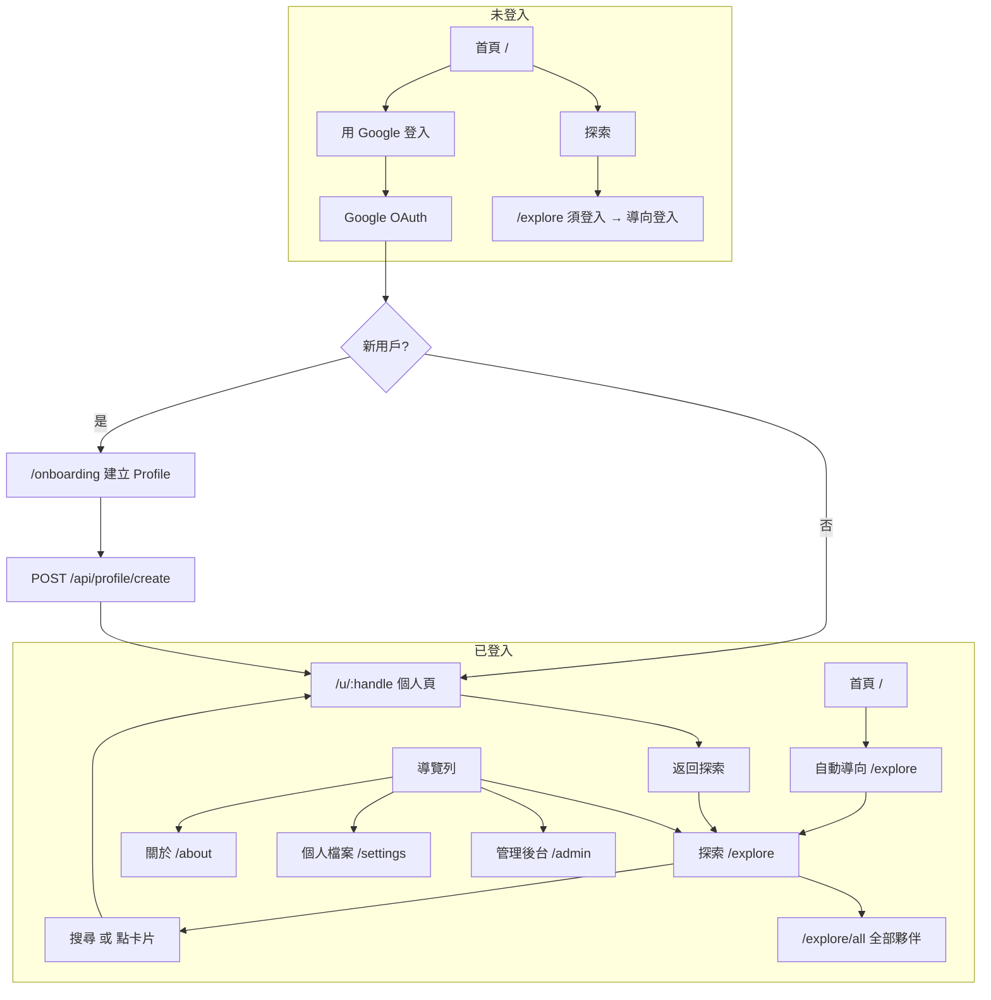
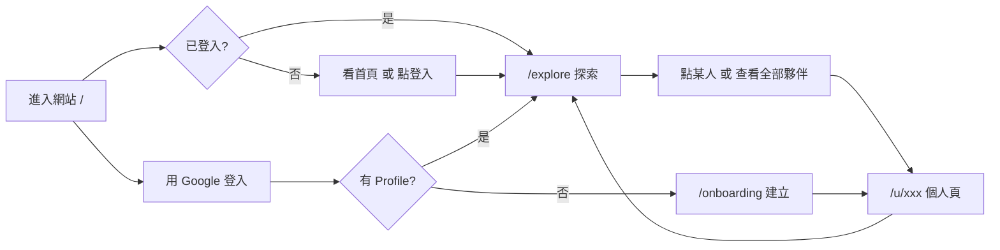
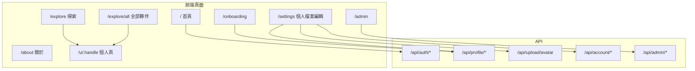

# YigongHub 網頁架構圖

## 路由與權限一覽

| 路徑 | 說明 | 權限 |
|------|------|------|
| `/` | 首頁（Landing） | 未登入：顯示介紹與登入；已登入：自動導向 `/explore` |
| `/signin` | 登入頁 | 所有人 |
| `/about` | 關於 YigongHub | **須登入** |
| `/explore` | 探索社群（搜尋、熱門標籤、與你相似的人、最新 Profile） | **須登入** |
| `/explore/all` | 全部夥伴（依屆數排序） | **須登入** |
| `/onboarding` | 建立個人檔案（新用戶首次） | 已有 Profile 會導向個人頁 |
| `/settings` | 編輯個人檔案 | **須登入** |
| `/u/[handle]` | 個人頁 | **須登入** |
| `/admin` | 管理後台 | **僅管理員** |
| 404 | 找不到頁面 | 顯示「返回首頁」 |

---

## 整體流程（Mermaid）

## 簡化流程（使用者視角）

## 導覽列（SiteHeader）連結

| 項目 | 路徑 | 顯示條件 |
|------|------|----------|
| YigongHub | `/` | 所有人 |
| 關於 | `/about` | **僅已登入** |
| 探索 | `/explore` | 所有人 |
| 個人檔案 | `/settings` | 已登入 |
| 管理後台 | `/admin` | 僅管理員 |
| 登入 / 登出 | `/signin` 或 signout | 依登入狀態 |

## API 路由一覽

| 方法 | 路徑 | 說明 |
|------|------|------|
| - | `/api/auth/[...nextauth]` | Auth.js 登入／登出／callback |
| POST | `/api/profile/create` | 建立 Profile（onboarding） |
| GET | `/api/profile/me` | 取得當前使用者 Profile |
| PATCH | `/api/profile/update` | 更新 Profile |
| POST | `/api/profile/experiences` | 新增經歷 |
| PATCH | `/api/profile/experiences/[id]` | 更新經歷 |
| DELETE | `/api/profile/experiences/[id]` | 刪除經歷 |
| POST | `/api/upload/avatar` | 上傳大頭照 |
| POST | `/api/account/delete-request` | 申請刪除帳號 |
| GET | `/api/admin/users` | 管理員：取得使用者列表 |
| PATCH | `/api/admin/users/[id]` | 管理員：更新使用者（如指派 admin） |

## 頁面與資料流

